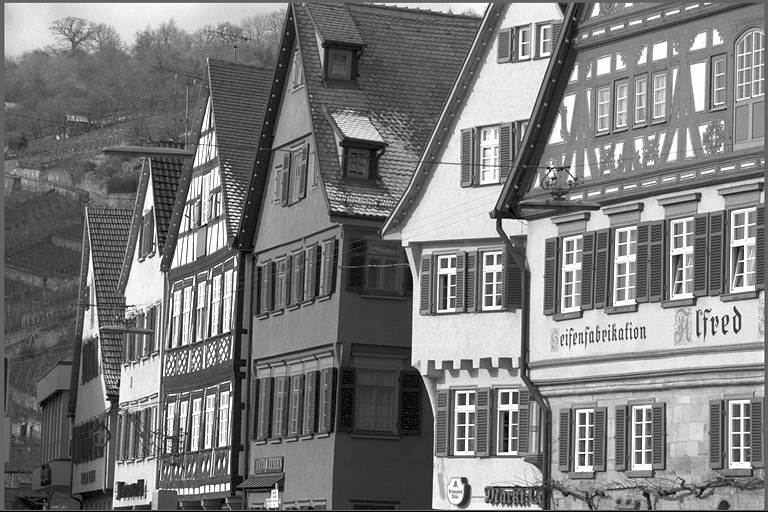
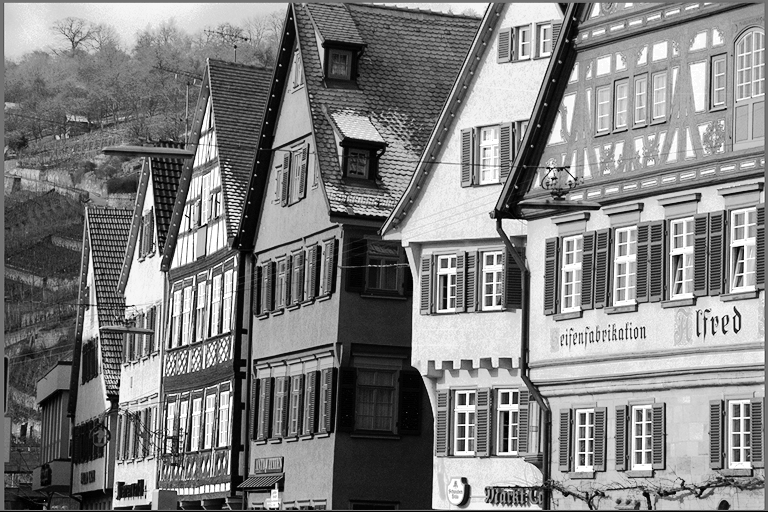

# Cuda Image Histogram Equalization

Cuda code to perform global histogram equalization. This repository also have python bindings for the same to be used in python scripts.

# Results

## Original Image

## Histogram Equalized Image

# Performance

Image Size: 800x600

| Device | Runtime |
--- | --- | 
| CUDA (3090ti) | 0.207808 ms |
|CPU     (i9) | 1.18752 ms (OpenCV Code) |

# Requirements

- install Opencv
- pip install pybind11

# Code Structure

### histogram_eq_kernels.h

All the kernels are declared here

### histogram_eq_kernels.cu

All the kernels are defined here

### histogram_eq_wrapper.cu

wrapper for python bindings

### histogram_eq_main.cu

main cpp code to validate the implementation. prints the timings of the GPU kernel and compares it to OpenCV implementation. My implementation should have a lower runtime.

### test_hist_eq.py

main py code to test bindings. prints the timings of the GPU kernel and compares it to OpenCV implementation. 
Usually OpenCV wins here. Calling cpp functions from python is very heavy